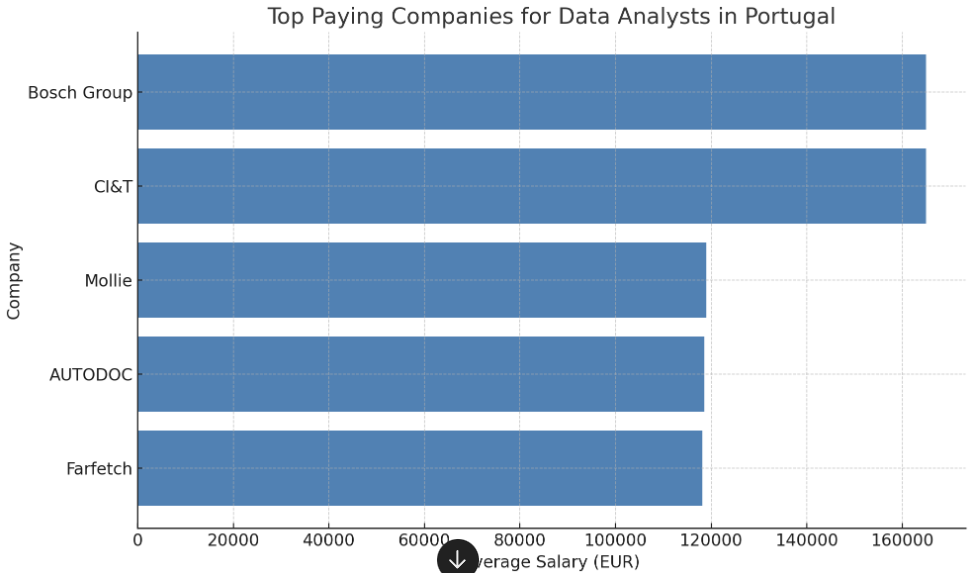

# 📊 Data Analysis of Job Postings and Key Skills

## 📌 Introduction

This project is a deep dive into the world of job market data, focusing on **Data Analyst roles**. The goal is to analyze job postings, uncover the most in-demand skills, understand salary trends, and provide actionable insights for both job seekers and industry professionals. Using structured datasets and SQL, we extract meaningful patterns and correlations to answer critical questions about the job market.
Check out my SQL queries here [project_sql_folder](/project.sql/)
---

## 📖 Background

As the demand for data-driven roles continues to rise, understanding job market trends is more important than ever. By analyzing job postings, this project aims to bridge the gap between candidate skills and employer needs. 

Key datasets used in this project:
- **`job_postings_fact`**: Includes job titles, salaries, and locations.
- **`skills_job_dim`**: Maps jobs to the skills they require.
- **`skills_dim`**: Contains the details of each skill.
- **`company_dim`**: Provides information about hiring companies.

---

## 🛠 Tools I Used

- **🗄 SQL**: For querying and analyzing relational data.
- **📂 Relational Database**: To simulate real-world datasets with normalized tables.
- **🔗 GitHub**: For version control, collaboration, and project sharing.
- **💻 Visual Studio Code**: As the main code editor for SQL and other project-related coding tasks.
- **🐘 PostgreSQL**: The relational database management system used for storing and querying data.

---

## 🔍 The Analysis

### 1️⃣ **Top Paying Jobs in Portugal**
This analysis identifies the top-paying jobs in Portugal for Data Analysts, including information about the job location, company name, and salary averages. This insight helps job seekers target opportunities that align with their financial goals.

```sql
SELECT 
    job_title_short,
    salary_year_avg,
    job_location,
    name AS company_name
FROM job_postings_fact
LEFT JOIN company_dim ON job_postings_fact.company_id = company_dim.company_id
WHERE job_work_from_home = true 
  AND salary_year_avg IS NOT NULL 
  AND job_title_short = 'Data Analyst'
ORDER BY salary_year_avg DESC
LIMIT 10;
```

**Visualization** :


### 2️⃣ **Top Paying Companies For Remte Work**
A ranking of companies offering the highest salaries for Data Analyst roles remotely. The results also include the technical skills required for these top-paying roles, allowing professionals to understand what expertise is most valued.

| Company                     |Average Salary ($)      | Top Skills            |
|-----------------------------|------------------------|-----------------------|
| AT&T                        | 255,829                | SQL, Python, R        |
| Pinterest Job Advertisements| 232,423                | SQL, Python, R        |
| Uclahealthcareers           | 217,000                | SQL , Crystal ,Oracle |
| SmartAsset                  |205,000                 | SQL , Python,Snowflake|
| Inclusively                 | 189,309                | SQL, Python, Azure    |

### 3️⃣ **Top In-Demand Skills**
This section highlights the most sought-after skills for Data Analysts, showcasing which capabilities are frequently mentioned in job postings. The findings guide professionals in upskilling effectively.


| Skill             | Jobs        |
|-------------------|-------------|
| sql               | 92628       |
| excel             | 67031       |
| python            | 57326       |
| tableau           | 46554       |
| power Bi          | 39468       |

**Visualization** :


### 4️⃣ **Top Paying Skills**
By analyzing job postings, this section reveals the technical skills associated with the highest average salaries. It helps job seekers prioritize which skills to learn to maximize their earning potential.

| Skill             | Average Salary ($) |
|-------------------|--------------------|
| svn               | 400,000            |
| solidity          | 179,000            |
| couchbase         | 160,515            |
| datarobot         | 155,486            |
| golang            | 155,000            |


### 5️⃣ **Optimal Skills**
This query combines salary data with skill demand to identify the skills that are not only in demand but also yield the best salaries. A strategic guide for career advancement.

| Skill            | Average Salary ($) |  Skills Demand |   
|------------------|--------------------|----------------|
| kafka            | 129,999            |       40       |
| pytorch          | 125,226            |       20       |
| perl             | 12,686             |       20       |
| tenserflow       | 120,647            |       24       |
| cassandra        | 118;407            |       11       | 


### 6️⃣ **Optimal Skills in a Single Query**
A comprehensive query that integrates both salary and skill demand insights in one step, offering a holistic view of the most lucrative and sought-after skillsets for Data Analysts.

```sql
SELECT 
        skills_job_dim.skill_id,
        skills_dim.skills,
        COUNT (skills_job_dim.skill_id) AS skill_count, 
        ROUND (AVG (salary_year_avg),0) AS average_salary

FROM job_postings_fact 

INNER JOIN skills_job_dim ON job_postings_fact.job_id = skills_job_dim.job_id
INNER JOIN skills_dim ON skills_job_dim.skill_id = skills_dim.skill_id

WHERE 
        job_title_short = 'Data Analyst' AND
        salary_year_avg is NOT NULL 

GROUP BY skills_job_dim.skill_id ,skills_dim.skills


HAVING   COUNT (skills_job_dim.skill_id) > 10 

ORDER BY average_salary DESC , skill_count DESC
LIMIT 25 
```


## 🌟 What I Learned

- **SQL Expertise**: Improved proficiency in handling complex queries, joins, and aggregations.  
- **Market Trends**: Gained insights into skills that boost employability and salaries.  
- **Data Insights**: Enhanced my ability to interpret and derive actionable insights from relational datasets.  
- **Career Impact**: Learned how employers prioritize skills and job flexibility.


## 🚀 Conclusions

This project provided several key takeaways:  
1. **Skills Matter**: Tools like **SQL**, **Python**, and **Tableau** are critical for Data Analyst roles.  
2. **Remote Jobs Pay More**: Companies are increasingly offering higher salaries for remote opportunities.  
3. **Skill-Driven Salaries**: Advanced technical skills significantly impact earning potential.

📈 **Future Work**:  
- Expand to other roles like Data Scientist and Software Engineer.  
- Explore regional salary trends.  
- Use machine learning for predictive analytics on salaries and skills demand.

---

📁 **Repository Highlights**:  
This repository includes SQL scripts, insights, and reports to guide job seekers and analysts in understanding the job market. Explore, learn, and adapt it for your needs! 💡

🔗 Check it out, and feel free to contribute!  
